# AI Literacy Workshop

## Table of Contents
- [AI Literacy Workshop](#ai-literacy-workshop)
  - [AI Search](#ai-search)
   

---

## AI Search

### AI Assisted Research

## AI Search

### AI Assisted Research

AI tools powered by Large Language Models are reshaping research by moving beyond simple keyword matching. These AI search tools now interpret the meaning behind your questions, analyze large volumes of content, and deliver clear, summarized insights. As AI continues to advance quickly, it will likely transform how we search for, engage with, and understand information.

### Smarter Searching: Use AI to Expand Your Keywords and Enhance Your Search

Traditional search, like a library catalog, finds resources by lexical matching - it directly matches your search terms with keywords in the resource's metadata, such as its title or author.

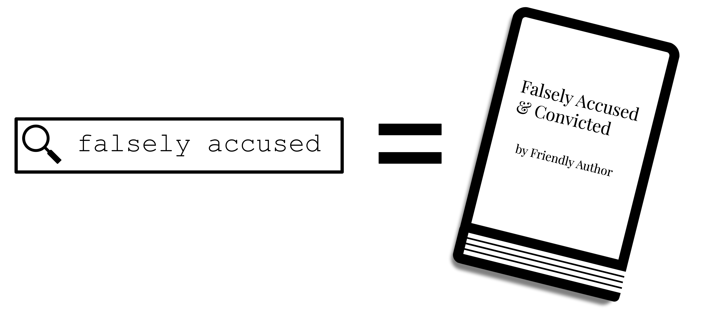
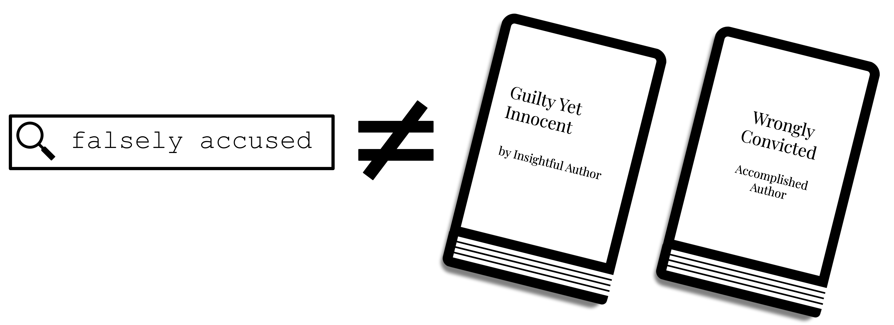
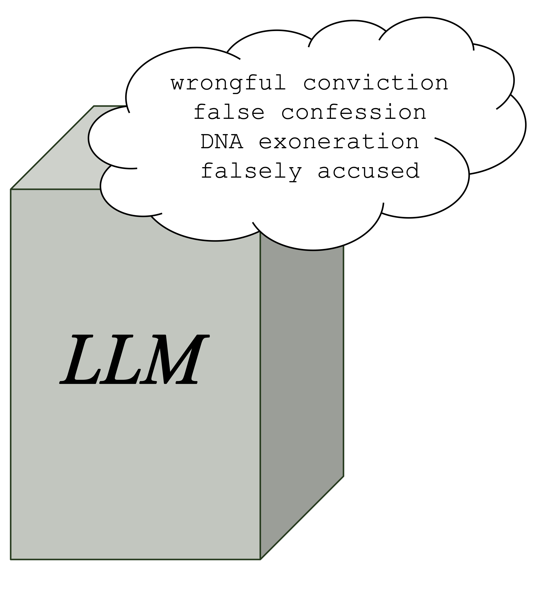

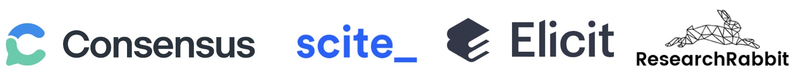

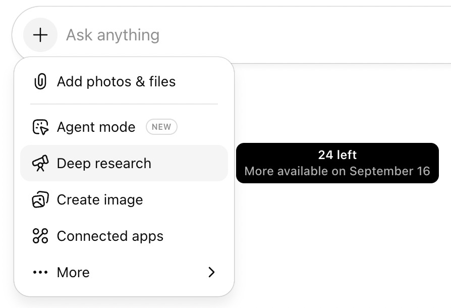

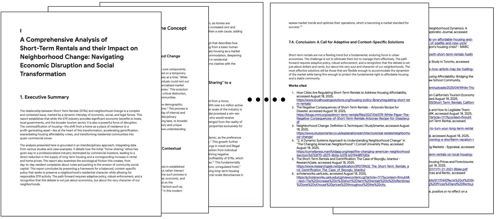
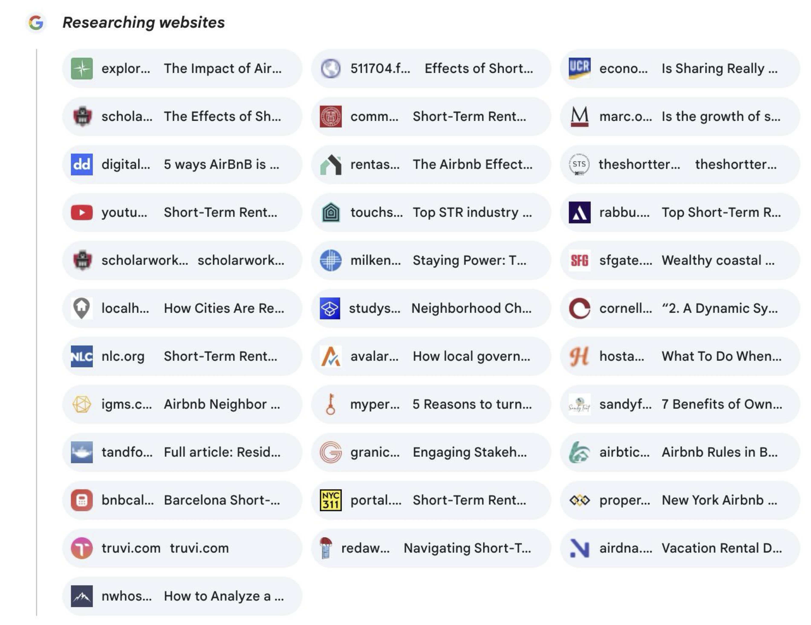
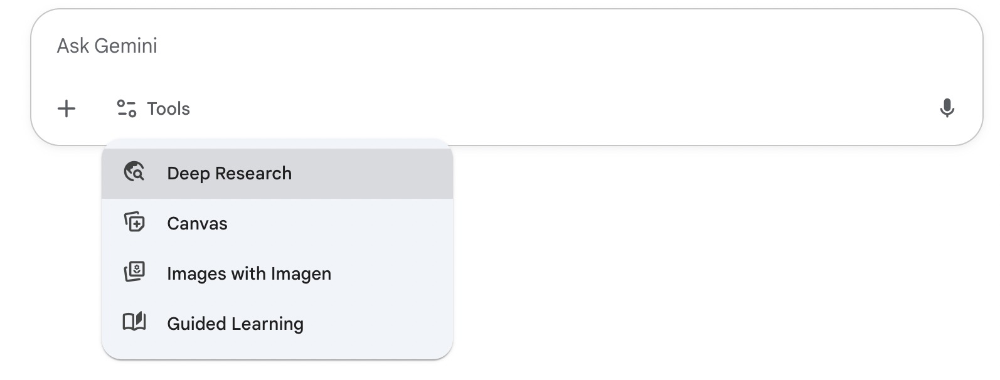

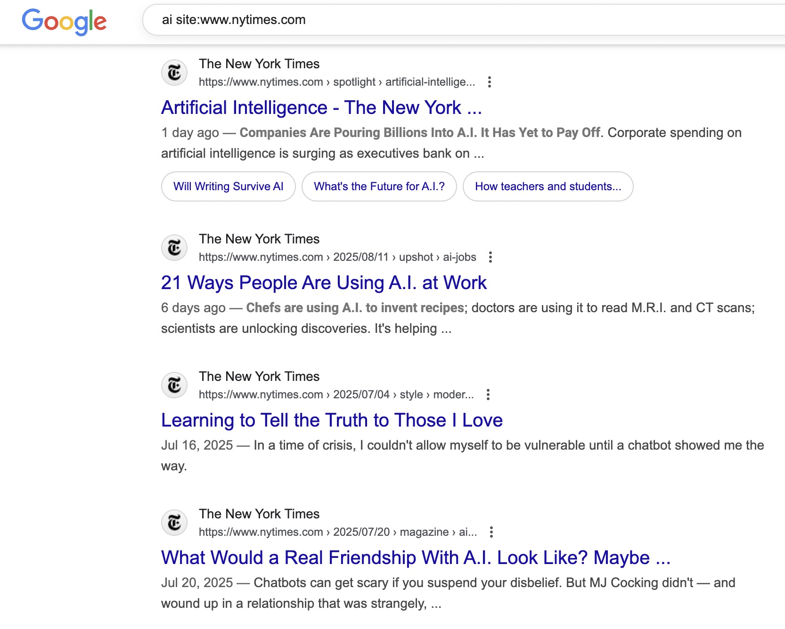
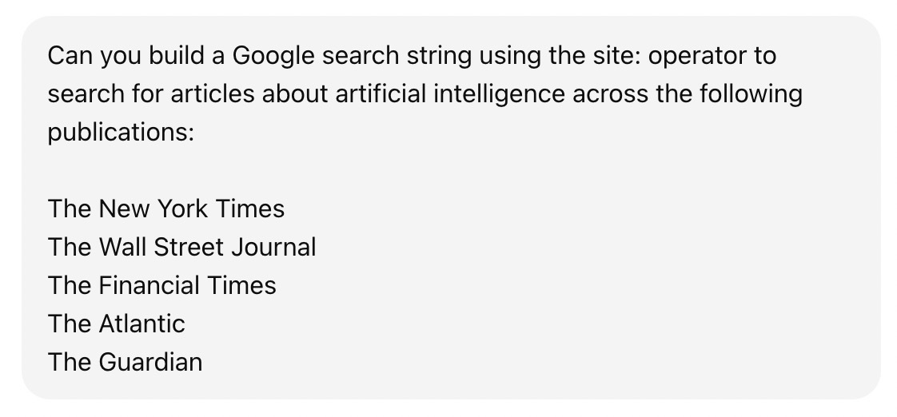
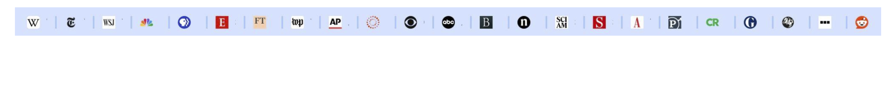
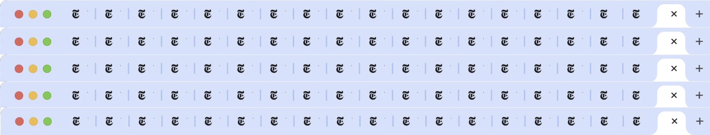
