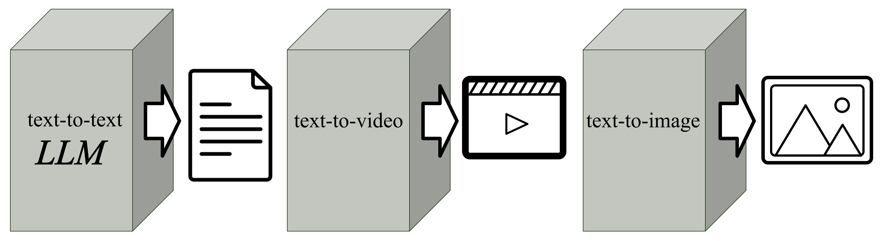
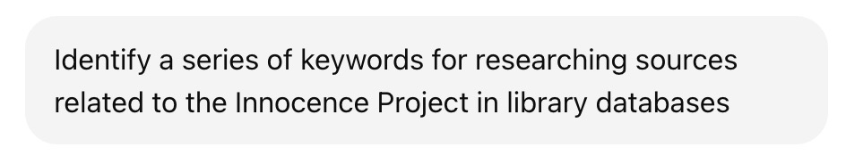

<link rel="stylesheet" type="text/css" href="custom.css">

# AI Literacy Workshop

## Table of Contents
- [AI Literacy Workshop](#ai-literacy-workshop)
    - [Generative AI](#generative-ai)
    - [Large Language Models (LLM)](#large-language-models)
    - [Retrieval Augmented Generation (RAG)](#retrieval-augmented-generation)
    - [AI Search](#ai-search)

   

---
## Generative AI

Generative AI refers to tools that can create new content - text, images, video, code, even music - based on written or spoken prompts. These systems are designed to recognize patterns in data and generate outputs that look and sound like human-created work. 

This gives students and researchers remarkable power: you can brainstorm ideas, visualize complex concepts, or rehearse how to explain them. But be cautious: just because AI can generate content does not mean that content is accurate, verified, or most importantly: appropriate to cite as an authority. Always consult your instructor or course syllabus to determine whether using generative AI is permitted in your coursework.

| Tool | Description |
|------|-------------|
| [Microsoft Copilot](https://www.microsoft.com/en-us/microsoft-copilot) | Microsoft Copilot is an AI assistant built into Microsoft 365. Copilot functions as a traditional AI-powered chatbot enabling it to summarize, analyze, and generate text and code. Copilot is the default generative AI tool at Baruch College because the CUNY-secure deployment ensures that data stays within the protected institutional environment and is not shared externally. While Copilot is widely available to the public, students and faculty should access the data-secure version through Microsoft Office 365 on the web or local installation. |
| [OpenAI ChatGPT](https://chat.openai.com/) | ChatGPT, powered by OpenAI’s GPT models, is widely regarded as the industry standard for conversational AI. Known for its versatility and fluency, it is a powerful general-purpose model that can generate, summarize, and analyze text across a wide range of domains. |
| [Google Gemini](https://gemini.google.com/) | Gemini is Google’s multimodal model, designed to natively understand and work with text, images, video, and audio. It represents Google’s flagship LLM platform and integrates tightly with other Google products and services. |
| [Anthropic Claude](https://www.anthropic.com/claude) | Claude, developed by Anthropic, emphasizes safety and ethical alignment through an approach known as “Constitutional AI.” It is designed to reduce harmful outputs while still being a capable and versatile conversational model. |
| [Meta Llama 3](https://ai.meta.com/llama/) | Llama 3 is Meta’s open-source family of Large Language Models, freely available for developers and researchers. It is widely used in academic and industry projects, offering strong performance with flexible licensing compared to commercial models. |
| [Mistral](https://mistral.ai/) | Mistral AI is a European startup developing powerful open-source and commercial LLMs, emphasizing efficiency and smaller models that run well on limited hardware. |

---

## Large Language Models (LLM)

---

## Retrieval Augmented Generation (RAG)
---
## AI Search

### AI Assisted Research

AI tools powered by Large Language Models are reshaping research by moving beyond simple keyword matching. These AI search tools now interpret the meaning behind your questions, analyze large volumes of content, and deliver clear, summarized insights. As AI continues to advance quickly, it will likely transform how we search for, engage with, and understand information.

### Smarter Searching: Use AI to Expand Your Keywords and Enhance Your Search

Traditional search, like a library catalog, finds resources by lexical matching - it directly matches your search terms with keywords in the resource's metadata, such as its title or author.

A drawback of lexical matching is you can unknowingly miss potential resources unless you exhaustively search all relevant keywords: 

